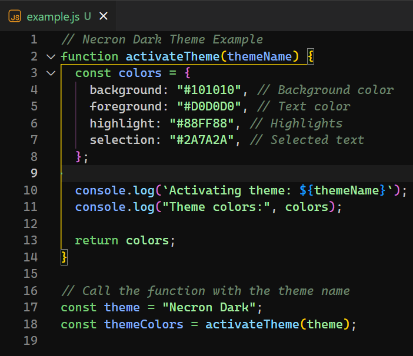
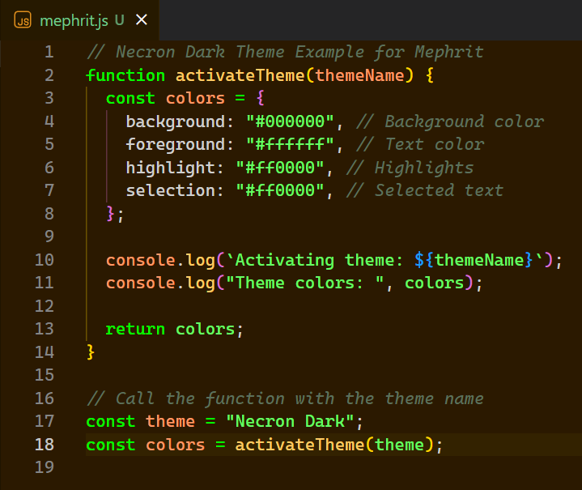
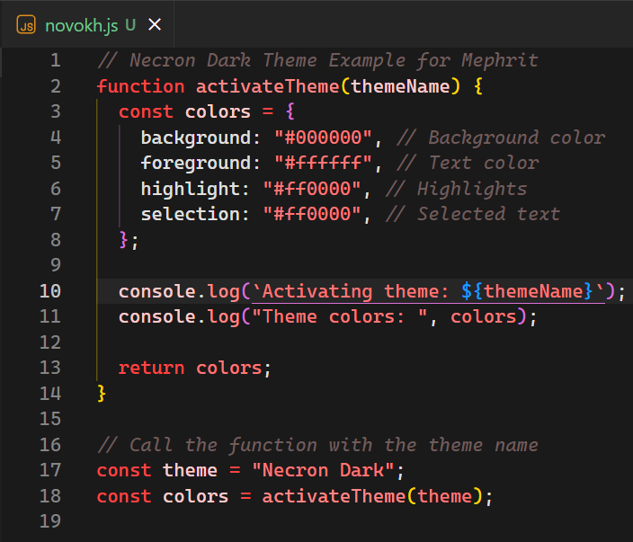
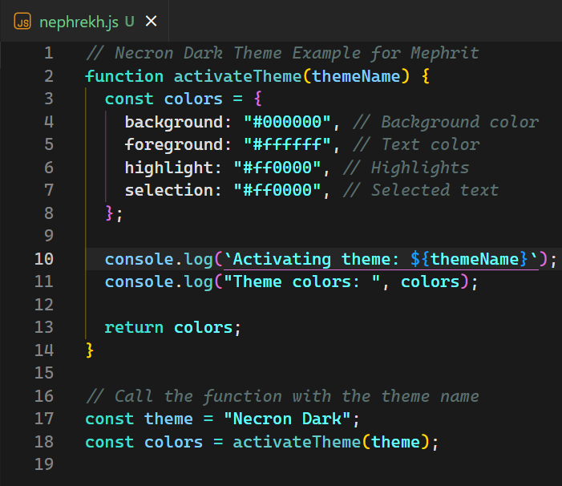
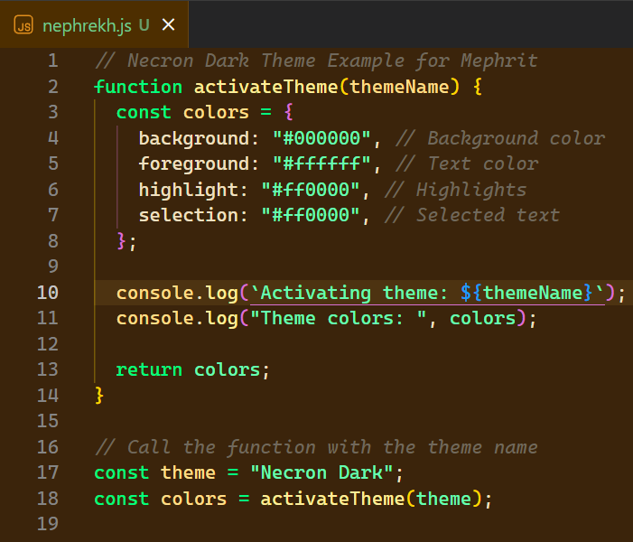
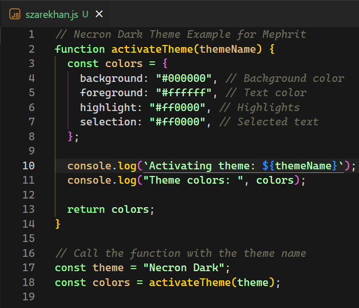

# **Necron Dark Theme Pack**

_A collection of dark themes inspired by the Necron dynasties from Warhammer 40,000. Designed for immersive and prolonged coding sessions._

---

## **Table of Contents**

- [Introduction](#introduction)
- [Installation](#installation)
- [Available Themes](#available-themes)
- [Previews](#previews)
- [Features](#features)
- [Contributing](#contributing)
- [License](#license)
- [Enjoy Coding!](#enjoy-coding)

---

## **Introduction**

The **Necron Dark Theme Pack** brings the enigmatic and ancient Necron dynasties to your Visual Studio Code environment. Choose from a variety of themes, each reflecting the unique color schemes and characteristics of the Necron dynasties:

- **Sautekh**
- **Mephrit**
- **Novokh**
- **Nihilakh**
- **Nephrekh**
- **Thokt**
- **Szarekhan**

---

## **Installation**

1. **Install the Theme Pack**:

   - **Via VS Code Marketplace**:

     - Open the Extensions view by pressing `Ctrl+Shift+X` (or `Cmd+Shift+X` on macOS).
     - Search for `Necron Dark Theme Pack`.
     - Click **Install**.

   - **Manual Installation**:
     - Download the latest release from the [GitHub Repository](https://github.com/Ecm83/necron-dark-theme).
     - Unzip and copy the extension folder to your VS Code extensions directory.

2. **Activate a Theme**:

   - Press `Ctrl+K Ctrl+T` (or `Cmd+K Cmd+T` on macOS).
   - Select one of the **Necron Dark** themes from the list.

---

## **Available Themes**

- **Necron Dark - Sautekh**
- **Necron Dark - Mephrit**
- **Necron Dark - Novokh**
- **Necron Dark - Nihilakh**
- **Necron Dark - Nephrekh**
- **Necron Dark - Thokt**
- **Necron Dark - Szarekhan**

---

## **Previews**

### **Necron Dark - Sautekh**

A theme with dark metallic backgrounds and glowing green highlights.

### **Necron Dark - Mephrit**

Features a dark bronze palette with neon green accents.

### **Necron Dark - Novokh**

Combines metallic dark tones with striking red highlights.

### **Necron Dark - Nihilakh**

Showcases dark metallic bases with turquoise blue accents.

### **Necron Dark - Nephrekh**

Presents a golden metallic theme with luminous green or blue elements.

### **Necron Dark - Thokt**

Features deep dark backgrounds with electric blue highlights.

### **Necron Dark - Szarekhan**

A dark metallic theme with golden and green details, embodying the majesty of the Silent King's dynasty.

---

## **Features**

- 🌌 **Immersive Dark Backgrounds**: Each theme provides a unique dark metallic background inspired by Necron technology.
- ✨ **Distinctive Highlights**: Custom color accents reflect the iconic colors of each dynasty.
- 🖥️ **Optimized for Comfort**: Ideal for long coding sessions with minimal eye strain.
- 🛠️ **Enhanced Readability**: Carefully selected contrasts and colors for optimal code readability.
- 🎨 **Variety of Choices**: Seven themes to choose from, allowing personalization to your preference.

---

## **Contributing**

We welcome contributions! If you have ideas, suggestions, or improvements, feel free to:

- **Fork the Repository**: [GitHub Repository](https://github.com/Ecm83/necron-dark-theme)
- **Create Issues**: Report bugs or request features.
- **Submit Pull Requests**: Help improve the themes.

---

## **License**

This project is licensed under the MIT License. See the [LICENSE](LICENSE.txt) file for details.

---

## **Enjoy Coding!**

Unleash the power of the Necron dynasties and enhance your coding experience with the **Necron Dark Theme Pack**. Choose your dynasty and dominate your development sessions!

---

**Connect with Us**

- **GitHub**: [Ecm83/necron-dark-theme](https://github.com/Ecm83/necron-dark-theme)
- **Marketplace**: [Visual Studio Code Marketplace](#)

---

_Note: All trademarks are the property of their respective owners. This theme pack is an unofficial creation inspired by Warhammer 40,000 and is not affiliated with or endorsed by Games Workshop._
